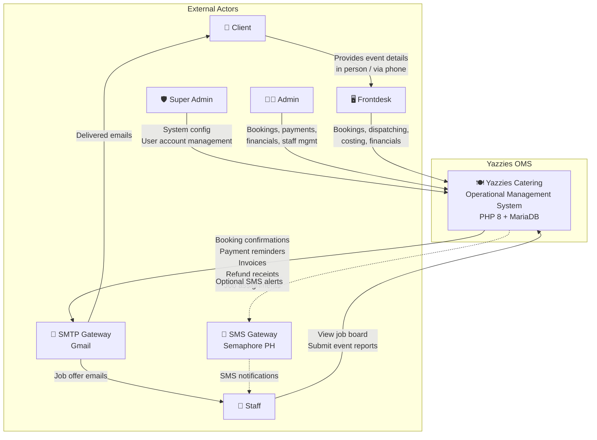
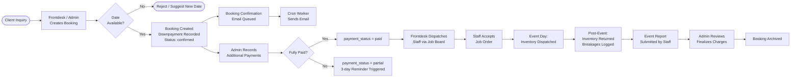
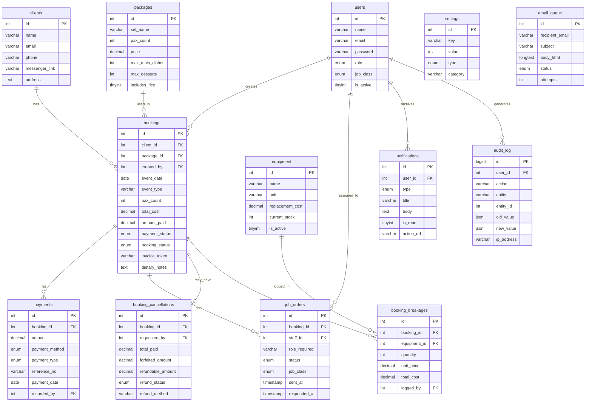

# Yazzies Catering Operational Management System (OMS)
# Enterprise-Grade System Documentation & User Manual
**Version:** 1.0.0 | **Last Updated:** May 2026 | **Classification:** Internal Use Only

---

# 1. Executive Overview

## Company Profile

**Yazzies Catering Services** is a catering company based in Dasmariñas City, Cavite, Philippines. Prior to this system, the business managed bookings via manual ledgers, spreadsheets, and verbal staff coordination — leading to double-bookings, lost payment records, and no centralized visibility of operations.

The **Yazzies Catering Operational Management System (OMS)** is a purpose-built, web-based internal platform that digitizes and centralizes every operational function: booking management, financial tracking, menu configuration, staff dispatching, inventory control, and automated client communications. It is designed exclusively for internal staff use and is not a public-facing portal.

## Unique Selling Proposition (USP)

| Feature | Description |
|---|---|
| **100% Dynamic Business Rules** | All financial constants (min PAX, downpayment %, overtime rate, extra PAX rate, staff ratios, session timeout, lockout duration) are stored in the `settings` database table and loaded at runtime via `appSetting()`. No redeployment is needed to change a business rule. |
| **Unified Role Architecture** | Every page and every API endpoint independently calls `requireRole()` or `requireApiRole()`. The `admin` role is the highest tier with universal access. |
| **Strict Separation of Duties** | Four distinct roles with non-overlapping authority. Frontdesk cannot access financial reports. Staff cannot access bookings. Only Admin/SuperAdmin can record payments or cancel bookings. |
| **CSRF Protection on All Mutations** | Every state-changing API call requires a valid CSRF token verified server-side via `requireCsrf()`. Tokens are rotated on every login via `session_regenerate_id()`. |
| **Transactional Data Integrity** | All multi-step financial operations (booking creation, payment recording, cancellation, inventory dispatch) are wrapped in `PDO::beginTransaction()` / `commit()` / `rollBack()` blocks with row-level `FOR UPDATE` locks to prevent race conditions. |
| **Asynchronous Email Queue** | Emails are not sent synchronously. They are inserted into the `email_queue` table and dispatched by `cron_worker.php` on a 5-minute schedule, decoupling email delivery from the user request lifecycle. |
| **DomPDF PDF Generation** | Invoices, contracts, and grocery lists are rendered as professional PDFs server-side using the DomPDF library via `includes/pdf_generator.php`. |
| **Deep-Link Notifications** | The in-app notification system (v2) stores an `action_url` per notification. Clicking a notification marks it read and redirects the user directly to the relevant record. |

## System Limitations (MVP Boundaries)

| Limitation | Detail |
|---|---|
| **No Public Client Portal** | The system is strictly an internal operational tool used by management, frontdesk, and staff. Clients cannot log in, view status, or interact with the system directly. |
| **Manual Payment Verification** | There is no external API payment gateway (e.g., Stripe, PayPal). Digital payments rely on reference numbers which must be manually verified by an Admin/Finance officer. Payment processing is delayed if the authorized staff is away. |
| **Duration & Service Constraints** | The system enforces single-day, single-service events. A client cannot book a multi-day event, nor can they book a "whole day" (Breakfast + Lunch + Dinner) in a single transaction. They must select one specific service type. |
| **Fixed Guest Count (Pax)** | Once a booking is finalized, the system does not natively support adding additional pax or modifying the guest count dynamically. |
| **Internet Dependency** | The system requires an active internet connection to function. There is no offline mode or local caching for disconnected operations. |
| **Communication Limits** | There is no in-app messaging or chat feature. Internal communication relies strictly on the automated notification bell. Furthermore, SMS capabilities are not included in this build. |
| **No Data Exporting** | Users cannot export tables or records (e.g., Financials, Bookings) to CSV or Excel from the UI. The only export capability is a full database SQL backup accessible only by the SuperAdmin. |
| **No Digital Signatures** | System-generated PDFs (Contracts, Invoices) do not support cryptographic digital signatures. They serve as printable references only. |

---

# 2. Architecture & System Diagrams

## 2.1 Context Diagram



## 2.2 Data Flow Diagram — Level 0



## 2.3 Entity-Relationship Diagram



---

# 3. Database Data Dictionary

Database: `yazzie` | Engine: InnoDB | Charset: utf8mb4_unicode_ci

---

## 3.1 `users`
The single authentication and authorization table for all internal system users.

| Column | Type | Key | Description |
|---|---|---|---|
| `id` | int unsigned | PK, AI | Unique user identifier |
| `name` | varchar(100) | | Full name. Must match pattern `[a-zA-Z\s\-\.]+` |
| `email` | varchar(150) | UNIQUE | Login email. Used as username |
| `password` | varchar(255) | | Bcrypt hash (PASSWORD_BCRYPT). Never stored in plain text |
| `role` | enum | | `admin`, `frontdesk`, `staff` |
| `phone` | varchar(20) | | Optional 11-digit PH mobile number |
| `is_active` | tinyint(1) | | `1`=active, `0`=deactivated (soft delete) |
| `created_at` | timestamp | | Account creation timestamp |
| `job_class` | enum | | `head_cook`, `cook`, `waiter`, `server`, `helper`, `any`, `admin`, `frontdesk` — mirrors role for non-admin users |

---

## 3.2 `clients`
Stores all catering clients. Not linked to the `users` table — clients do not log in.

| Column | Type | Key | Description |
|---|---|---|---|
| `id` | int unsigned | PK, AI | Unique client identifier |
| `name` | varchar(100) | IDX | Full name of client or organization |
| `email` | varchar(150) | | Contact email. Used for invoice and booking confirmation delivery |
| `messenger_link` | varchar(255) | | Optional Facebook/Messenger URL |
| `phone` | varchar(20) | | Required contact phone number |
| `address` | text | | Full mailing/event address |
| `created_at` | timestamp | | Record creation timestamp |

---

## 3.3 `bookings`
The central operational table. Every confirmed event creates one row here.

| Column | Type | Key | Description |
|---|---|---|---|
| `id` | int unsigned | PK, AI | Booking identifier (e.g., Booking #56) |
| `client_id` | int unsigned | FK→clients | The client for this event |
| `package_id` | int unsigned | FK→packages | Optional — the selected menu package |
| `event_type` | varchar(50) | | e.g., `Wedding`, `Birthday`, `Corporation` |
| `event_date` | date | UNIQUE, IDX | The date of the event. UNIQUE enforces one event per day |
| `event_time` | time | | Scheduled start time (optional) |
| `actual_start_time` | time | | Actual time recorded post-event |
| `actual_end_time` | time | | Actual end time recorded post-event |
| `overtime_minutes` | int unsigned | | Minutes beyond the standard event duration |
| `overtime_rate` | decimal(10,2) | | Rate per hour for overtime (default ₱200, from settings) |
| `overtime_total` | decimal(10,2) | | Computed: `overtime_minutes / 60 * overtime_rate` |
| `event_location` | text | | Full venue address |
| `pax_count` | int unsigned | | Actual guest count |
| `base_pax` | int unsigned | | Pax tier snapped to nearest 50 |
| `extra_pax` | int unsigned | | `pax_count - base_pax` (if pax exceeds tier) |
| `base_price` | decimal(10,2) | | Package or tier base price |
| `extra_cost` | decimal(10,2) | | `extra_pax * rate_per_pax` |
| `transport_fee` | decimal(10,2) | | Optional delivery/transport surcharge |
| `surcharge_total` | decimal(10,2) | | Sum of custom item prices and excess dish fees |
| `total_cost` | decimal(10,2) | | `base_price + extra_cost + transport_fee + surcharge_total + overtime_total + breakage_total` |
| `amount_paid` | decimal(10,2) | | Running sum of all non-refund payments |
| `payment_status` | enum | IDX | `unpaid`, `partial`, `paid` |
| `booking_status` | enum | IDX | `inquiry`, `pending`, `confirmed`, `completed`, `cancelled` |
| `is_archived` | tinyint(1) | IDX | `1` = moved to archive after completion |
| `archived_at` | timestamp | | When the booking was archived |
| `archived_by` | int unsigned | | User ID who archived it |
| `invoice_token` | varchar(255) | | 32-char hex token for public invoice URL (generated via `bin2hex(random_bytes(16))`) |
| `notes` | text | | Internal staff notes |
| `event_report_notes` | text | | Staff-submitted post-event report notes |
| `dietary_notes` | text | | Allergy/dietary restrictions from client |
| `created_by` | int unsigned | FK→users | User who created the booking |
| `report_submitted_by` | int unsigned | FK→users | Staff who submitted the event report |
| `created_at` | timestamp | | Booking creation timestamp |
| `updated_at` | timestamp | | Auto-updated on any row change |
| `report_submitted_at` | timestamp | | When the event report was filed |

---

## 3.4 `packages`
Defines the menu package tiers available for selection during booking.

| Column | Type | Key | Description |
|---|---|---|---|
| `id` | int unsigned | PK, AI | Package ID |
| `set_name` | varchar(100) | UNIQUE(name,pax) | Tier name: `Standard`, `Premium`, `Luxury` |
| `pax_count` | int unsigned | UNIQUE(name,pax) | Base pax for this tier (50, 75, 100) |
| `price` | decimal(10,2) | | Flat price at base pax count |
| `max_main_dishes` | int unsigned | | Max free main dishes per booking (default 5) |
| `max_desserts` | int unsigned | | Max free desserts per booking (default 1) |
| `includes_rice` | tinyint(1) | | Whether rice is included (default 1) |
| `inclusions` | text | | Free-text description of package inclusions |
| `is_active` | tinyint(1) | | `0` = hidden from booking stepper |

---

## 3.5 `payments`
Immutable ledger of all financial transactions per booking. Negative amounts represent refunds.

| Column | Type | Key | Description |
|---|---|---|---|
| `id` | int unsigned | PK, AI | Payment record ID |
| `booking_id` | int unsigned | FK→bookings, IDX | Associated booking |
| `amount` | decimal(10,2) | | Payment amount. Negative for refunds |
| `payment_method` | enum | | `cash`, `bank_transfer`, `gcash`, `maya` |
| `payment_type` | enum | IDX | `payment` or `refund` |
| `refund_reason` | varchar(255) | | Populated when `payment_type = refund` |
| `reference_no` | varchar(100) | | Required for digital payments (GCash/Maya/bank) |
| `payment_date` | date | | Date of transaction |
| `notes` | text | | e.g., "Downpayment", "Final balance" |
| `recorded_by` | int unsigned | FK→users, IDX | Staff who entered this record |
| `created_at` | timestamp | | Record creation timestamp |

---

## 3.6 `job_orders`
Tracks staff dispatch assignments per booking. One row per staff-per-booking offer.

| Column | Type | Key | Description |
|---|---|---|---|
| `id` | int unsigned | PK, AI | Job order ID |
| `booking_id` | int unsigned | FK→bookings, IDX | The event this order is for |
| `staff_id` | int unsigned | FK→users, IDX | The staff member being offered the job |
| `role_required` | varchar(50) | | e.g., `waiter`, `head_cook`, `cook` |
| `status` | enum | | `pending`, `accepted`, `declined` |
| `sent_at` | timestamp | | When the job offer was dispatched |
| `responded_at` | timestamp | | When the staff member responded |
| `notes` | text | | Optional notes from dispatcher |
| `job_class` | enum | | Mirrors `users.job_class` at time of assignment |

---

## 3.7 `equipment`
Master list of trackable catering equipment items.

| Column | Type | Key | Description |
|---|---|---|---|
| `id` | int unsigned | PK, AI | Equipment ID |
| `name` | varchar(100) | | e.g., "Dinner Plate (Ceramic)" |
| `unit` | varchar(20) | | e.g., `pcs`, `sets` |
| `replacement_cost` | decimal(10,2) | | Cost to replace one unit if broken/lost |
| `current_stock` | int unsigned | | Current warehouse quantity (deducted on dispatch, restored on return) |
| `is_active` | tinyint(1) | | `0` = retired from inventory |
| `created_at` | timestamp | | Record creation timestamp |
| `updated_at` | timestamp | | Auto-updated on stock changes |

---

## 3.8 `booking_inventory`
Tracks equipment dispatched to and returned from each event.

| Column | Type | Key | Description |
|---|---|---|---|
| `id` | int unsigned | PK, AI | Dispatch record ID |
| `booking_id` | int unsigned | FK→bookings | Associated booking |
| `equipment_id` | int unsigned | FK→equipment | Item dispatched |
| `quantity_out` | int unsigned | | Quantity sent to event |
| `quantity_in` | int unsigned | | Quantity returned after event |
| `dispatch_notes` | text | | Notes at time of dispatch |
| `return_notes` | text | | Notes at time of return |
| `dispatched_by` | int unsigned | FK→users | User who recorded dispatch |
| `dispatched_at` | timestamp | | When dispatched |
| `returned_by` | int unsigned | FK→users | User who recorded return |
| `returned_at` | timestamp | | When returned |

---

## 3.9 `booking_breakages`
Auto-logged when returned quantity < dispatched quantity. Also used for client billing.

| Column | Type | Key | Description |
|---|---|---|---|
| `id` | int unsigned | PK, AI | Breakage record ID |
| `booking_id` | int unsigned | FK→bookings | Associated booking |
| `equipment_id` | int unsigned | FK→equipment | Broken/lost item |
| `quantity` | int unsigned | | Number of units broken/lost |
| `unit_price` | decimal(10,2) | | Snapshotted `replacement_cost` at log time |
| `total_cost` | decimal(10,2) | | `quantity * unit_price` |
| `notes` | varchar(255) | | Description of breakage |
| `logged_by` | int unsigned | FK→users | User who logged the breakage |
| `logged_at` | timestamp | | Timestamp of log |

---

## 3.10 `booking_cancellations`
One-to-one record tracking a cancellation request and its refund lifecycle.

| Column | Type | Key | Description |
|---|---|---|---|
| `id` | int unsigned | PK, AI | Cancellation record ID |
| `booking_id` | int unsigned | FK→bookings, UNIQUE | One cancellation per booking |
| `requested_by` | int unsigned | FK→users | Staff who initiated the cancellation |
| `approved_by` | int unsigned | FK→users | Admin who processed it |
| `status` | enum | IDX | `requested`, `approved`, `rejected` |
| `reason` | varchar(255) | | Client-provided cancellation reason |
| `policy_json` | json | | Snapshot of active cancellation policy at time of request |
| `total_paid` | decimal(10,2) | | `bookings.amount_paid` at time of cancellation |
| `forfeited_amount` | decimal(10,2) | | `total_paid * CANCEL_FORFEIT_PCT` (default 50%) |
| `refundable_amount` | decimal(10,2) | | `total_paid - forfeited_amount` |
| `refund_status` | enum | | `pending`, `processed`, `waived` |
| `refund_method` | enum | | `cash`, `gcash`, `maya`, `bank_transfer` |
| `refund_reference` | varchar(100) | | Reference number for digital refund |
| `refund_processed_at` | timestamp | | When the refund was completed |
| `refund_processed_by` | int unsigned | | Admin who processed the refund |
| `cancelled_at` | timestamp | | When the cancellation was initiated |
| `notes` | text | | Additional internal notes |

---

## 3.11 `booking_dishes`
Junction table linking a booking to the selected menu dishes.

| Column | Type | Key | Description |
|---|---|---|---|
| `id` | int unsigned | PK, AI | Record ID |
| `booking_id` | int unsigned | FK→bookings | Associated booking |
| `dish_id` | int unsigned | FK→dishes | Selected dish |

*Unique constraint on `(booking_id, dish_id)` prevents duplicate selections.*

---

## 3.12 `booking_custom_items`
Stores non-standard add-ons attached to a booking (e.g., lechon, special decorations).

| Column | Type | Key | Description |
|---|---|---|---|
| `id` | int unsigned | PK, AI | Record ID |
| `booking_id` | int unsigned | FK→bookings | Associated booking |
| `name` | varchar(255) | | Name of the custom item |
| `category` | enum | | `main`, `dessert`, `other` |
| `price` | decimal(10,2) | | Flat price added to `surcharge_total` |
| `notes` | text | | Optional description |
| `created_at` | timestamp | | Record creation timestamp |

---

## 3.13 `booking_staff` (Legacy)
Earlier staff linking table. Superseded by `job_orders` for dispatching workflow.

| Column | Type | Key | Description |
|---|---|---|---|
| `id` | int unsigned | PK, AI | Record ID |
| `booking_id` | int unsigned | FK→bookings | Booking |
| `staff_id` | int unsigned | FK→users | Staff member |
| `role` | varchar(50) | | Assigned role label |
| `assigned_at` | timestamp | | Assignment timestamp |
| `assigned_by` | int unsigned | FK→users | Who assigned |

---

## 3.14 `dishes`
Master list of all available menu dishes across all categories.

| Column | Type | Key | Description |
|---|---|---|---|
| `id` | int unsigned | PK, AI | Dish ID |
| `name` | varchar(100) | | Dish name (e.g., "Chicken Curry") |
| `category` | varchar(30) | IDX | `Beef`, `Pork`, `Chicken`, `Seafood`, `Vegetables`, `Pasta`, `Rice`, `Dessert` |
| `base_pax` | int | | Reference pax count for recipe scaling |
| `is_active` | tinyint(1) | | `0` = hidden from menu selection |
| `custom_fee` | decimal(10,2) | | Extra per-pax charge if dish exceeds free allowance |
| `description` | varchar(255) | | Optional dish description |
| `created_at` | timestamp | | Record creation timestamp |

---

## 3.15 `recipe_ingredients`
Per-dish ingredient list used for grocery list generation and costing.

| Column | Type | Key | Description |
|---|---|---|---|
| `id` | int unsigned | PK, AI | Ingredient record ID |
| `dish_id` | int unsigned | FK→dishes | Parent dish |
| `ingredient_name` | varchar(100) | | Name of ingredient |
| `base_quantity` | decimal(10,4) | | Quantity needed for the base_pax |
| `unit` | varchar(30) | | `kg`, `pcs`, `L`, `packs` |
| `unit_price` | decimal(10,2) | | Cost per unit (NULL = not yet costed) |
| `supplier` | varchar(100) | | Optional supplier name |
| `created_at` | timestamp | | Record creation timestamp |

---

## 3.16 `dish_ingredients` (Legacy)
Earlier ingredient schema, superseded by `recipe_ingredients`. May be present but unused.

| Column | Type | Key | Description |
|---|---|---|---|
| `id` | int unsigned | PK, AI | Record ID |
| `dish_id` | int unsigned | FK→dishes | Parent dish |
| `ingredient_name` | varchar(100) | | Ingredient name |
| `qty_per_pax` | decimal(10,4) | | Quantity per single guest |
| `unit` | varchar(20) | | Unit of measure |
| `price_per_unit` | decimal(10,2) | | Cost per unit |

---

## 3.17 `settings`
Key-value store for all dynamic business rules. Loaded at runtime by `appSetting()`.

| Column | Type | Key | Description |
|---|---|---|---|
| `id` | int unsigned | PK, AI | Setting ID |
| `key` | varchar(80) | UNIQUE | Setting identifier (e.g., `min_pax`, `extra_pax_rate`) |
| `value` | text | | The setting's current value |
| `type` | enum | | `string`, `int`, `float`, `bool`, `json` — controls cast behavior |
| `description` | varchar(255) | | Human-readable description |
| `category` | varchar(30) | | Grouping: `general`, `finance`, `operations`, `staffing`, `system` |
| `updated_by` | int unsigned | FK→users | Last admin to update this setting |
| `updated_at` | timestamp | | Auto-updated on change |

**Active Settings Registry:**

| Key | Default | Category | Purpose |
|---|---|---|---|
| `min_pax` | 50 | general | Minimum guests per booking |
| `max_pax` | 300 | general | Maximum guests per booking |
| `min_lead_time_days` | 1 | general | Minimum days before event for booking |
| `standard_dp_percent` | 0.30 | finance | Standard downpayment % (30%) |
| `rush_dp_percent` | 1.00 | finance | Full payment required within 72hrs |
| `extra_pax_rate` | 125 | financial | PHP per extra pax beyond base tier |
| `overtime_rate_per_hour` | 200 | financial | PHP per hour of overtime |
| `event_duration_hours` | 4 | booking | Standard event duration in hours |
| `operating_hours_start` | 08:00 | operations | Earliest event start time |
| `operating_hours_end` | 21:59 | operations | Latest event end time |
| `waiter_ratio_wedding` | 10 | staffing | Pax per waiter for weddings/corp |
| `waiter_ratio_birthday` | 20 | staffing | Pax per waiter for other events |
| `staff_hourly_rate` | 75 | financial | PHP per staff hour |
| `cancel_forfeiture_percent` | 0.50 | finance | % of paid amount forfeited on cancel |
| `max_admins` | 5 | system | Maximum admin accounts allowed |
| `session_timeout_minutes` | 30 | system | Inactivity timeout (minimum 5 min) |
| `max_login_attempts` | 5 | system | Failed attempts before lockout |
| `lockout_duration_minutes` | 15 | system | Duration of IP/email lockout |
| `company_name` | Yazzies Catering Services | general | Company name on documents |

---

## 3.18 `notifications`
Per-user in-app notification inbox with deep-link support.

| Column | Type | Key | Description |
|---|---|---|---|
| `id` | int unsigned | PK, AI | Notification ID |
| `user_id` | int unsigned | FK→users, IDX | Target user |
| `type` | enum | | `job_assigned`, `job_declined`, `leave_approved`, `leave_rejected`, `leave_reviewed`, `balance_reminder`, `event_reminder`, `general` |
| `title` | varchar(150) | | Notification title |
| `body` | text | | Full notification body |
| `is_read` | tinyint(1) | IDX | `0`=unread, `1`=read |
| `booking_id` | int unsigned | FK→bookings | Associated booking (optional) |
| `link_url` | varchar(500) | | Deep-link URL for click navigation |
| `action_url` | varchar(500) | | v2 — relative URL stored server-side |
| `created_at` | timestamp | IDX | Notification creation timestamp |

---

## 3.19 `email_queue`
Asynchronous email delivery queue processed by `cron_worker.php`.

| Column | Type | Key | Description |
|---|---|---|---|
| `id` | int unsigned | PK, AI | Queue entry ID |
| `recipient_email` | varchar(255) | | Destination email address |
| `recipient_name` | varchar(255) | | Display name for the recipient |
| `subject` | varchar(255) | | Email subject line |
| `body_html` | longtext | | Full HTML email body |
| `status` | enum | IDX | `pending`, `sending`, `sent`, `failed` |
| `attempts` | int unsigned | | Number of delivery attempts (max 3) |
| `error_log` | text | | SMTP error message on failure |
| `created_at` | timestamp | | When the email was queued |
| `sent_at` | timestamp | | When successfully delivered |

---

## 3.20 `audit_log`
Immutable log of all significant data mutations in the system.

| Column | Type | Key | Description |
|---|---|---|---|
| `id` | bigint unsigned | PK, AI | Log entry ID |
| `user_id` | int unsigned | FK→users, IDX | User who performed the action |
| `action` | varchar(60) | IDX | e.g., `payment_recorded`, `booking_created`, `user_deactivated` |
| `entity` | varchar(30) | IDX | `booking`, `payment`, `client`, `job_order`, `user` |
| `entity_id` | int unsigned | IDX | ID of the affected record |
| `old_value` | longtext (JSON) | | State before the change (JSON) |
| `new_value` | longtext (JSON) | | State after the change (JSON) |
| `ip_address` | varchar(45) | | Client IP address (IPv4/IPv6) |
| `created_at` | timestamp | IDX | Timestamp of the action |

---

## 3.21 `login_attempts`
Brute-force protection. Records failed login attempts by IP and email.

| Column | Type | Key | Description |
|---|---|---|---|
| `id` | int unsigned | PK, AI | Record ID |
| `ip_address` | varchar(45) | IDX(ip+time) | Client IP address |
| `email` | varchar(255) | | Email attempted (for email-based locking) |
| `attempted_at` | timestamp | IDX | When the attempt occurred |

*Records older than 24 hours are purged by `cron_worker.php`.*

---

## 3.22 `leave_requests`
Staff leave management. Prevents dispatching staff on approved leave dates.

| Column | Type | Key | Description |
|---|---|---|---|
| `id` | int unsigned | PK, AI | Leave request ID |
| `staff_id` | int unsigned | FK→users | Requesting staff member |
| `leave_date` | date | UNIQUE(staff,date), IDX | Requested leave date |
| `reason` | varchar(255) | | Optional reason |
| `status` | enum | IDX | `pending`, `approved`, `rejected` |
| `reviewed_by` | int unsigned | FK→users | Admin/frontdesk who reviewed |
| `reviewed_at` | timestamp | | When the review was made |
| `created_at` | timestamp | | Request creation timestamp |

---

## 3.23 `archived_bookings`
Snapshot table for completed events. Manual archive preserves historical data.

| Column | Type | Key | Description |
|---|---|---|---|
| `id` | int unsigned | PK, AI | Archive record ID |
| `original_id` | int unsigned | UNIQUE | Original `bookings.id` |
| `client_name` | varchar(100) | | Snapshot of client name |
| `client_phone` | varchar(20) | | Snapshot of client phone |
| `event_date` | date | IDX | Event date |
| `event_time` | time | | Event time |
| `event_location` | text | | Event venue |
| `pax_count` | int unsigned | | Guest count |
| `total_cost` | decimal(10,2) | | Final total cost |
| `amount_paid` | decimal(10,2) | | Total paid |
| `payment_status` | enum | | `unpaid`, `partial`, `paid` |
| `notes` | text | | Staff notes snapshot |
| `archived_at` | timestamp | | When archived |
| `archived_by` | int unsigned | | User who archived |

---

## 3.24 `taste_testing`
Tracks pre-booking taste test sessions for prospective clients.

| Column | Type | Key | Description |
|---|---|---|---|
| `id` | int unsigned | PK, AI | Record ID |
| `client_id` | int unsigned | FK→clients | Associated client (if exists) |
| `scheduled_date` | date | IDX | Date of the taste test |
| `scheduled_time` | time | | Time of the taste test |
| `location` | varchar(255) | | Venue/address |
| `status` | enum | IDX | `pending`, `confirmed`, `completed`, `cancelled`, `converted` |
| `notes` | text | | Internal notes |
| `created_by` | int unsigned | FK→users | Who scheduled it |
| `converted_to_booking_id` | int unsigned | FK→bookings | If converted to a real booking |
| `converted_at` | timestamp | | Conversion timestamp |
| `converted_by` | int unsigned | FK→users | Who converted it |

---

## 3.25 `taste_test_appointments`
Alternative/newer taste test schema (v2) with prospect support.

| Column | Type | Key | Description |
|---|---|---|---|
| `id` | int unsigned | PK, AI | Record ID |
| `client_id` | int unsigned | FK→clients | Existing client (optional) |
| `prospect_name` | varchar(120) | | Name if no client record yet |
| `prospect_phone` | varchar(20) | | Phone if no client record yet |
| `prospect_email` | varchar(255) | | Email if no client record yet |
| `desired_date` | date | IDX | Requested date |
| `desired_time` | time | | Requested time |
| `location` | varchar(255) | | Meeting location |
| `notes` | text | | Internal notes |
| `status` | enum | IDX | `requested`, `confirmed`, `completed`, `cancelled` |
| `created_by` | int unsigned | FK→users | Scheduling user |
| `confirmed_by` | int unsigned | FK→users | Confirming user |
| `cancelled_by` | int unsigned | FK→users | Cancelling user |
| `converted_booking_id` | int unsigned | FK→bookings | Linked booking post-conversion |

---

## 3.26 `taste_test_feedback`
Stores feedback and ratings collected after a taste test is completed.

| Column | Type | Key | Description |
|---|---|---|---|
| `id` | int unsigned | PK, AI | Record ID |
| `appointment_id` | int unsigned | FK→taste_test_appointments | Associated appointment |
| `rating` | tinyint unsigned | | 1–5 star rating |
| `feedback` | text | | Written feedback text |
| `recorded_by` | int unsigned | FK→users | Staff who recorded feedback |
| `created_at` | timestamp | | Recording timestamp |


---

# 4. User Roles & Capabilities

The system enforces three roles defined in `users.role`. Role checks are performed independently on every page load (`requireRole()`) and every API call (`requireApiRole()`). `admin` inherits all permissions universally.

---

## 4.1 Admin (`admin`)
**Primary Responsibility:** System Governance, Business Operations & Financial Management

| Module | Access | Notes |
|---|---|---|
| Dashboard | **Read** | KPI cards, revenue charts, upcoming events |
| Bookings | **Full CRUD** | Create, view, edit, cancel, archive bookings |
| Clients | **Full CRUD** | Add, edit, search, view client history |
| Package Pricing | **Full CRUD** | Create, activate/deactivate pricing tiers |
| Food & Menu (Dishes) | **Full CRUD** | Add, edit, toggle active status of dishes |
| Recipes & Costing | **Full CRUD** | Add/edit recipe ingredients, view cost estimates |
| Inventory Items | **Full CRUD** | Add/edit equipment master list and stock levels |
| Financials | **Full CRUD** | Record payments, view ledger, process cancellation refunds |
| Staff Dispatching | **Full CRUD** | Create job orders, broadcast to staff, view responses |
| Staff Management | **Full CRUD** | Create any account role (admin, frontdesk, staff) subject to quota |
| System Settings | **Full CRUD** | SMTP, session timeout, lockout, maintenance mode |
| Business Settings | **Full CRUD** | Edit operational settings (PAX limits, rates, operating hours) |
| Archive | **Read + Archive** | Archive completed bookings; view archive history |
| Audit Log | **Read** | View all system audit events |
| Cancellations | **Full CRUD** | Request cancellation, process refund via PUT endpoint |
| Backup | **Full access** | Generate and download SQL database dumps |

**What Admin CANNOT do (by design):**
- Cannot deactivate their own account.
- Cannot delete the `audit_log` table data via the UI (read-only display only)

---

## 4.2 Frontdesk (`frontdesk`)
**Primary Responsibility:** Client Logistics & Day-to-Day Operations

| Module | Access | Notes |
|---|---|---|
| Dashboard | **Read** | Upcoming events, today's events |
| Bookings | **Read + Create** | Can create bookings and view booking details. Cannot delete or cancel |
| Financials | **Read + Record Payments** | Can view ledger and record incoming payments |
| Staff Dispatching | **Full CRUD** | Can broadcast job orders and view responses |
| Grocery List / Costing | **Read** | Views the auto-generated ingredient list for upcoming events |

**What Frontdesk CANNOT do (by design):**
- Cannot access: Clients module (no standalone client management)
- Cannot access: Package Pricing, Dishes, Recipes, Inventory admin pages
- Cannot access: Staff Management (cannot create/edit user accounts)
- Cannot access: Business Settings or System Settings
- Cannot access: Archive or Audit Log
- Cannot process refunds (`PUT /src/api/cancellations.php` requires `admin` role)
- Can only see `staff` role in user lists (`src/api/staff.php` filters by role for frontdesk callers)

---

## 4.4 Staff (`staff`)
**Primary Responsibility:** On-Site Event Execution & Reporting

| Module | Access | Notes |
|---|---|---|
| Job Board (Dashboard) | **Read** | `views/staff/dashboard.php` — views all assigned job orders |
| Accept/Decline Jobs | **Write** | `PUT /src/api/dispatching.php` — responds to job offers |
| Event Report | **Write** | `views/staff/event_report.php` — submits post-event notes |
| Leave Requests | **Write** | Can submit, view own leave requests |
| Inventory Dispatch/Return | **Read + Write** | Can record equipment dispatch and returns on event day |

**What Staff CANNOT do (by design):**
- Cannot access any admin, frontdesk, client, booking, financial, or settings modules
- Cannot view other staff members' job orders
- Cannot create bookings, record payments, or process refunds
- Cannot create or edit any user account
- `requireApiRole('staff')` on dispatching PUT endpoint prevents any other role from responding to job offers on a staff member's behalf

---

# 5. Module & Process Inventory

## 5.1 Authentication Module
**Files:** `index.php`, `src/api/auth.php`, `includes/auth.php`, `includes/rate_limiter.php`, `logout.php`

Handles login, session management, and access control. Uses bcrypt password hashing. On login, the session is regenerated (`session_regenerate_id(true)`) and the CSRF token is rotated. The rate limiter tracks failed attempts by both **IP address and email address** in the `login_attempts` table, locking out after the configured threshold for the configured duration (both dynamically pulled from `settings`).

## 5.2 Booking Management Module
**Files:** `views/admin/bookings.php`, `views/frontdesk/bookings.php`, `src/api/bookings.php`, `includes/_booking_stepper.php`

The core module. Manages the full lifecycle from inquiry to completion. The booking stepper is a multi-step wizard collecting: client selection, event details (date, type, pax), package/tier selection, dish selection, custom items, transport fee, and downpayment. Date availability is validated against the `UNIQUE KEY` on `event_date`. Pricing is computed dynamically using the `computePaxPricing()` function. Bookings auto-complete from `confirmed` to `completed` when the event date passes (via `autoCompleteExpiredBookings()` called on every GET).

## 5.3 Payments & Financials Module
**Files:** `views/admin/financial.php`, `src/api/payments.php`

Records all incoming and outgoing payments into the `payments` table. Supports `cash`, `gcash`, `maya`, and `bank_transfer`. Digital payments require a reference number. After each payment is recorded, `bookings.amount_paid` and `bookings.payment_status` are recalculated. Refund entries are negative-amount payment records with `payment_type = 'refund'`. The financial view includes a full per-booking payment ledger.

## 5.4 Cancellation & Refund Module
**Files:** `src/api/cancellations.php`, `views/admin/financial.php`

Two-step cancellation flow: (1) POST to create the cancellation request (status: `pending`, booking goes to `pending_cancellation`), (2) Admin PUT to finalize with refund method and reference, which inserts a negative payment record and sets `booking_status = 'cancelled'`. Forfeiture is calculated as `total_paid * CANCEL_FORFEIT_PCT` (default 50%, configurable). A refund receipt email is sent on finalization.

## 5.5 Staff Dispatching Module
**Files:** `views/frontdesk/dispatching.php`, `src/api/dispatching.php`

Implements a broadcast job-offer model. Admin/Frontdesk selects staff from a suggestion engine that shows availability (checks `leave_requests` and existing `job_orders`). Job offers are inserted into `job_orders` with `status = 'pending'`. Staff are notified via in-app notifications and email. Staff accept or decline via their Job Board. Conflicts (approved leave, double-booking) are blocked at the API level. One `head_cook` per event is enforced.

## 5.6 Inventory Management Module
**Files:** `views/admin/inventory.php`, `src/api/inventory.php`, `src/api/inventory_dispatch.php`

Two sub-processes: (1) **Dispatch** (pre-event): items are checked out from the warehouse (`current_stock` decremented). (2) **Return** (post-event): items are checked back in (`current_stock` incremented by delta). If returned quantity < dispatched quantity, breakages are **automatically logged** to `booking_breakages` with replacement cost, and `bookings.total_cost` is recalculated to include the surcharge.

## 5.7 Staff Management Module
**Files:** `views/admin/staff.php`, `src/api/staff.php`

Create, update, deactivate (soft delete) user accounts. Password is hashed with bcrypt. Role creation is privilege-restricted: Admin can create `staff` and `frontdesk` only; super_admin can also create `admin`. Super admin accounts cannot be created via the UI. Phone numbers must be exactly 11 digits. Email must be unique. Staff `job_class` is set at creation and is mirrored to `job_orders.job_class` at time of dispatch.

## 5.8 Menu & Recipes Module
**Files:** `views/admin/dishes.php`, `views/admin/recipes.php`, `src/api/recipes.php`

Manages the 69-dish menu catalog across 9 categories. Each dish can have `recipe_ingredients` for costing and grocery list generation. The Recipes & Costing view allows admins to set per-unit prices and supplier info per ingredient. These are used by the Grocery List module to compute pre-event shopping quantities scaled to the booking's `pax_count`.

## 5.9 Grocery List / Costing Module
**Files:** `views/frontdesk/costing.php`, `templates/grocery_list.php`

Auto-generates a printable grocery list for an upcoming event by aggregating all `recipe_ingredients` for every dish in the booking, scaled by `pax_count`. Ingredients are grouped by category. A print-optimized PDF version can be generated.

## 5.10 Analytics & Reporting Module
**Files:** `views/admin/dashboard.php`, `src/api/analytics.php`

Provides KPI summary cards (confirmed bookings, total revenue, unpaid balances, pending staff offers) and revenue trend charts. All queries use PDO prepared statements with parameterized date range filters. Data is returned as JSON and rendered via vanilla JavaScript chart logic.

## 5.11 Notification Module
**Files:** `includes/notifications_helper.php`, `api/notifications/`, `includes/sidebar.php`

All notifications are dispatched via the `dispatchNotification()` helper function which writes to the `notifications` table. The bell icon in the sidebar polls `/api/notifications/get.php` every 60 seconds for unread count. Clicking a notification calls `/api/notifications/read.php` (POST) to mark it read, then deep-links the user to the `action_url`. Passive balance checks run every 30 minutes on sidebar load for admin/frontdesk roles.

## 5.12 Email Communication Module
**Files:** `includes/mailer.php`, `database/email_queue`, `cron_worker.php`

All emails (booking confirmation, payment reminder, invoice with PDF attachment, staff assignment, refund receipt, job response notification) are composed in `mailer.php` using a styled HTML template (`renderEmailTemplate()`). Bulk/automated emails are queued in `email_queue` and sent by `cron_worker.php`. Invoice emails use `sendMailImmediate()` for synchronous delivery with a PDF attachment generated by DomPDF.

## 5.13 PDF Generation Module
**Files:** `includes/pdf_generator.php`, `templates/invoice.php`, `templates/contract.php`, `templates/grocery_list.php`

Three PDF document types: **Invoice** (full financial breakdown with payment registry), **Contract** (event agreement with signature lines), **Grocery List** (scaled ingredient shopping list). Generated server-side using DomPDF. PHP evaluation is disabled in DomPDF config for security (`DOMPDF_ENABLE_PHP = false`).

## 5.14 Audit Log Module
**Files:** `includes/audit.php`, `src/api/audit_logs.php`

Records every significant state change via the `auditLog()` helper. Captures: `user_id`, `action`, `entity`, `entity_id`, `old_value` (JSON), `new_value` (JSON), and `ip_address`. Viewable in read-only format by Admin. SuperAdmin inherits this access.

## 5.15 Archive Module
**Files:** `views/admin/archive.php`, `src/api/archive.php`

Manual archival of completed bookings. Creates a snapshot row in `archived_bookings` preserving key financial data, then sets `bookings.is_archived = 1`. Archived bookings are excluded from the active bookings list by default. Auto-archival was deliberately removed in favor of manual control.

## 5.16 Leave Management Module
**Files:** `src/api/leave.php`

Staff submit leave requests for specific dates. Admin/Frontdesk approve or reject. Approved leave dates are checked during staff dispatching — staff on approved leave are automatically excluded from job offers for that date.

## 5.17 SuperAdmin System Settings Module
**Files:** `views/admin/superadmin.php`, `src/api/settings.php`

Exclusive to `super_admin`. Manages: SMTP credentials, session timeout, login lockout settings, maintenance mode toggle, debug mode toggle, max super admin quota. All settings write to the `settings` table and take effect immediately on the next request (cached per-request via `appSetting()` static cache).


---

# 6. Standard Operating Procedures (User Manual)

---

## SOP 6.1 — How to Book a Catering Event

**Who can perform this:** Admin, Frontdesk
**Prerequisite:** A client record must exist, OR the new-client fields in Step 2 must be filled.

### Step 1: Check Calendar Availability
1. Navigate to **Bookings** in the sidebar.
2. The calendar view displays all existing confirmed and pending events.
3. Identify a free date. A date is only available if no other booking uses it (the system enforces a unique constraint on `event_date`).
4. You can also use **Availability Check** by clicking the date on the calendar or querying `GET /src/api/availability.php?date=YYYY-MM-DD`.

### Step 2: Open the Booking Stepper
1. Click the **"+ New Booking"** button on the Bookings page.
2. The multi-step booking stepper (`includes/_booking_stepper.php`) opens as a modal/panel.

### Step 3: Select or Create a Client (Step 1 of Stepper)
- **Existing Client:** Type the client's name in the search field. Select from the dropdown results (calls `GET /src/api/clients.php?search=`).
- **New Client (inline creation):** Toggle "New Client" and fill in: Name (required), Phone (required), Email (optional), Address (optional). The API will auto-create the client and reuse the record if the email already exists.

### Step 4: Enter Event Details (Step 2 of Stepper)
Fill in the following fields:
- **Event Date:** Must be at least `min_lead_time_days` (default: 1 day) in the future and no more than 1 year ahead.
- **Event Time:** Must be within `operating_hours_start` (08:00) and `operating_hours_end` (21:59).
- **Event Type:** e.g., `Wedding`, `Birthday`, `Corporation`.
- **Guest Count (Pax):** Must be between `min_pax` (50) and `max_pax` (300).
- **Event Location:** Full venue address.
- **Dietary Notes:** Any allergy or special dietary requirements.
- **Notes:** Internal staff notes.

### Step 5: Select a Package (Step 3 of Stepper)
1. The stepper displays all active packages from the `packages` table (Standard, Premium, Luxury in 50/75/100 pax tiers).
2. If the client's pax count exceeds the base pax, the system automatically calculates `extra_pax` and `extra_cost` using the package's `price / pax_count` as the per-pax rate.
3. If no package is selected, the system falls back to the **Pax Tier pricing**: `base_price = 5,000 + (base_pax × 100)` snapped to the nearest 50-pax tier.

### Step 6: Select Menu Dishes (Step 4 of Stepper)
1. Dishes are displayed by category: Beef, Pork, Chicken, Seafood, Vegetables, Pasta, Rice, Dessert.
2. The package determines the free allowances: `max_main_dishes` (default 5) and `max_desserts` (default 1).
3. Selecting dishes beyond the free allowance triggers a surcharge based on the dish's `custom_fee` field.
4. Custom items (e.g., Lechon) can be added with a flat price.

### Step 7: Set Transport Fee (Step 5 of Stepper)
Enter a transport/delivery fee if applicable. This is added directly to `total_cost`.

### Step 8: Record Downpayment (Step 6 of Stepper — Final)
1. The computed `total_cost` is displayed (base + extra pax + transport + surcharges).
2. **Minimum Downpayment** is enforced:
   - **Standard bookings:** `total_cost × standard_dp_percent` (default 30%).
   - **Rush bookings (within 72 hours):** `total_cost × 1.00` (full payment required).
3. Select **Payment Method**: Cash, GCash, Maya, or Bank Transfer.
4. For digital payments, a **Reference Number** is required.
5. Click **Confirm Booking**.

### What Happens on Submit
The frontend POSTs to `src/api/bookings.php`:
1. Date availability is re-checked inside a transaction with a `FOR UPDATE` row lock.
2. The booking row is inserted into `bookings` with `booking_status = 'confirmed'`.
3. Selected dishes are inserted into `booking_dishes`.
4. Custom items are inserted into `booking_custom_items`.
5. The downpayment is inserted into `payments`.
6. `bookings.amount_paid` and `bookings.payment_status` are updated.
7. A booking confirmation email is queued in `email_queue`.
8. An audit log entry is created.
9. A `booking_confirmation` in-app notification is dispatched to admin/frontdesk users.

---

## SOP 6.2 — Generating & Sending an Invoice

**Who can perform this:** Admin, Frontdesk
**Prerequisite:** The booking must exist and the client must have an email address.

### Step 1: Open the Booking
1. Navigate to **Bookings**.
2. Locate the booking and click **View** or click the booking row to open the detail panel.

### Step 2: Trigger Invoice Generation
1. In the booking detail view, click the **"Send Invoice"** button.
2. This triggers a fetch `POST` to `src/api/send_invoice.php` with `{ "booking_id": X }`.

### What the System Does
The `send_invoice.php` endpoint executes these steps:
1. **Fetches** full booking and client data from the database.
2. **Validates** that the client has an email address. If not, returns an error.
3. **Calls** `generateInvoicePDF($pdo, $bookingId)` from `includes/pdf_generator.php`, which:
   - Queries the booking, client, all payments, all breakages, all dishes, all custom items.
   - Renders the HTML template from `templates/invoice.php`.
   - Passes the HTML to DomPDF to produce a binary PDF string.
4. **Prepares** an email body via `renderEmailTemplate()`.
5. **Calls** `sendMailImmediate()` (PHPMailer, synchronous — bypasses the queue), attaching the PDF as `Invoice_INV-XXXXX.pdf`.
6. Returns `{ "success": true, "message": "Invoice sent to client@email.com" }`.

### Viewing the Invoice in Browser
The invoice can also be viewed directly in the browser (for printing or review) via the URL:
```
/templates/invoice.php?booking_id=X&token=<invoice_token>
```
The `invoice_token` is a 32-character hex string generated at booking creation and stored in `bookings.invoice_token`.

---

## SOP 6.3 — Refund & Cancellation Workflow

**Who can perform this:**
- **Step 1 (Initiate):** Admin or Frontdesk
- **Step 2 (Process Refund):** Admin only

### Strict Cancellation Policy & Conflict Resolution
To prevent calendar race conditions (e.g., Client A cancels, Client B takes the date, Client A attempts to "un-cancel"), **all cancellations are final**. 
* The client is refunded exactly 50% of their total payment. 
* The remaining 50% is forfeited and retained as business profit. 
* If a client changes their mind after cancellation, they cannot "un-cancel" or apply the forfeited 50% to a new date. They must initiate a brand-new booking subject to current calendar availability.

### Step 1: Initiate Cancellation
1. Navigate to **Bookings** and open the booking to be cancelled.
2. Click the **"Cancel Booking"** button and provide a reason.
3. The frontend POSTs to `src/api/cancellations.php`:
   ```json
   { "booking_id": X, "reason": "Client requested cancellation" }
   ```
4. The API calculates:
   - `total_paid` = current `bookings.amount_paid`
   - `forfeited_amount` = `total_paid × 0.50` (50% retained profit)
   - `refundable_amount` = `total_paid - forfeited_amount`
5. A row is inserted into `booking_cancellations` with `refund_status = 'pending'`.
6. `bookings.booking_status` is set to `'pending_cancellation'`.
7. An audit log entry is created.

### Step 2: Process the Refund (Admin Only)
1. Navigate to **Financials** → **Cancellations** tab.
2. Find the pending cancellation record. It shows: total paid, forfeited amount, and refundable amount.
3. Select the **Refund Method** (cash/gcash/maya/bank_transfer) and enter the **Reference Number** (for digital refunds).
4. Click **"Mark as Processed"** or **"Mark as Waived"** (if no refund is due).
5. The frontend PUTs to `src/api/cancellations.php`:
   ```json
   { "id": X, "booking_id": Y, "refund_status": "processed", "refund_method": "gcash", "refund_reference": "REF123" }
   ```
6. The API (inside a transaction with row-level locks):
   - Inserts a **negative payment record** into `payments`: `amount = -refundable_amount`.
   - Recalculates `bookings.amount_paid` from the payments table sum.
   - Sets `bookings.booking_status = 'cancelled'`.
   - Updates the `booking_cancellations` row with the refund details and timestamp.
7. A **refund receipt email** is sent to the client.

---

## SOP 6.4 — Inventory Management

### Part A: Dispatching Equipment Before an Event

**Who can perform this:** Admin, Frontdesk, Staff

1. Navigate to **Bookings** → open the relevant booking → **Inventory** tab (or access via the dispatching page).
2. Click **"Dispatch Inventory"**.
3. Select items from the `equipment` master list and enter the quantity to dispatch.
4. Click **"Confirm Dispatch"**.
5. The frontend POSTs to `src/api/inventory_dispatch.php`:
   - The API checks `equipment.current_stock` for each item with a `FOR UPDATE` row lock.
   - If sufficient stock, inserts into `booking_inventory` and decrements `current_stock`.
   - If insufficient, returns an error with the available quantity.

### Part B: Logging Equipment Returns & Breakages

**Who can perform this:** Admin, Frontdesk, Staff

1. After the event, open the booking → **Inventory** tab.
2. For each dispatched item, enter the **quantity returned**.
3. Click **"Submit Return"**.
4. The frontend PUTs to `src/api/inventory_dispatch.php`:
   - `current_stock` is restored using the delta (`quantity_in` - previous `quantity_in`).
   - If `quantity_in < quantity_out`, the difference is **automatically logged as a breakage** in `booking_breakages` using the item's `replacement_cost`.
   - `bookings.total_cost` is recalculated to include the breakage charge.
   - `bookings.payment_status` is updated accordingly.
5. If `quantity_in = quantity_out` (all returned), any existing breakage record for that item is removed.

---

## SOP 6.5 — Staff Dispatching

### Part A: Broadcasting a Job Order

**Who can perform this:** Admin, Frontdesk

1. Navigate to **Staff Dispatching** in the sidebar.
2. Select the booking from the event list.
3. Click **"Dispatch Staff"**. The system loads the **Staff Suggestion Engine** (`GET /src/api/dispatching.php?suggest=1&booking_id=X`), which:
   - Calculates the recommended staff count: `pax_count ÷ ratio` (ratio = 10 for Wedding/Corporate, 20 for others).
   - Lists all active staff with their `availability` status: `available`, `on_leave`, or `booked`.
   - Marks staff already dispatched to this event as `already_dispatched`.
4. Select one or more staff members and assign a **Role** (e.g., `waiter`, `cook`, `head_cook`).
   - **Head Cook rule:** Only one head cook can be dispatched per event.
5. Click **"Send Job Offer"**.
6. The frontend POSTs to `src/api/dispatching.php`:
   - Staff on approved leave for that date are **skipped silently**.
   - Staff already dispatched (non-declined) are **skipped silently**.
   - `job_orders` rows are inserted with `status = 'pending'`.
   - An **in-app notification** is dispatched to each staff member via `dispatchNotification()`.
   - If `MAIL_ENABLED = true`, a **job assignment email** is sent to each staff member.

### Part B: How Staff Accept or Decline

**Who can perform this:** Staff only

1. Staff log in and are redirected to **Job Board** (`views/staff/dashboard.php`).
2. The Job Board shows all pending, accepted, and declined job orders via `GET /src/api/dispatching.php?my_jobs=1`.
3. Staff click **"Accept"** or **"Decline"** on a pending offer.
4. The frontend PUTs to `src/api/dispatching.php`:
   - **Accept:** The API checks for approved leave conflicts and double-booking conflicts. If clean, `job_orders.status` = `'accepted'`.
   - **Decline:** `job_orders.status` = `'declined'`.
5. An in-app notification is broadcast to all `admin`, `super_admin`, and `frontdesk` users with the staff member's response and a deep-link to the dispatching page.
6. If `MAIL_ENABLED = true`, an email is sent to all admin/frontdesk users.

---

## SOP 6.6 — Adding a New Client

### Method A: Standalone Client Creation
**Who can perform this:** Admin

1. Navigate to **Clients** (`views/admin/clients.php`).
2. Click **"+ Add Client"**.
3. Fill in the form:
   - **Name** (required)
   - **Phone** (required)
   - **Email** (optional, but required for email communications)
   - **Messenger Link** (optional)
   - **Address** (optional)
4. Click **Save**. The frontend POSTs to `src/api/clients.php`.
5. An audit log entry (`client_created`) is recorded.

### Method B: Inline Client Creation During Booking
**Who can perform this:** Admin, Frontdesk

1. In **Step 1 of the Booking Stepper**, toggle the **"New Client"** option.
2. Enter the new client's **Name**, **Phone**, and optionally **Email** and **Address**.
3. On booking submission, the API in `src/api/bookings.php` automatically:
   - Checks if the email already exists in `clients`. If so, reuses the existing client ID.
   - If not, inserts a new client row and uses the new ID for the booking.
4. The client record is created as part of the booking transaction.

---

## SOP 6.7 — Adding a New Staff Member

**Who can perform this:**
- **Admin:** Can create `staff` and `frontdesk` accounts only
- **Super Admin:** Can also create `admin` accounts

1. Navigate to **Staff** (`views/admin/staff.php`).
2. Click **"+ Add Staff"**.
3. Fill in the form:
   - **Name** (required, letters/spaces/hyphens/periods only)
   - **Email** (required, must be unique, valid email format, max 100 chars)
   - **Password** (required, must pass the password policy from `includes/security.php`)
   - **Role** (required): `staff`, `frontdesk`, or `admin` (admin-only option, super_admin callers only)
   - **Phone** (optional, must be exactly 11 digits)
   - **Job Class** (for `staff` role only): `head_cook`, `cook`, `waiter`, `server`, `helper`
4. Click **Save**. The frontend POSTs to `src/api/staff.php`.
5. The API enforces:
   - Super admin accounts **cannot be created** via this interface.
   - Admin quota is checked (`max_admins` setting, default 5).
   - Duplicate email is rejected with HTTP 409.
   - Password is hashed with `password_hash($password, PASSWORD_BCRYPT)`.
6. An audit log entry (`user_created`) is recorded.

**Deactivating a Staff Member:**
1. Click the **Edit** button on any staff row.
2. Toggle the **Active** switch to off.
3. The account is soft-deleted (`is_active = 0`). The user cannot log in.
4. The user's historical data (bookings, payments, job orders) is preserved.
5. Restrictions: You cannot deactivate your own account. Only super_admin can deactivate admin accounts.

---

## SOP 6.8 — Password Recovery / Forgot Password

> **⚠️ Important System Limitation:** The Yazzies OMS does **not** have an automated "Forgot Password" email flow (no password reset link sent by email). This feature was not implemented in the current MVP.

### Current Password Reset Procedure

**If a Staff Member forgets their password:**
1. The staff member contacts an **Admin** or the **Super Admin**.
2. The Admin navigates to **Staff** (`views/admin/staff.php`).
3. Clicks **Edit** on the affected staff member's row.
4. Enters a new temporary password in the **Password** field. The password must meet the system's password policy (enforced by `validatePasswordPolicy()` in `includes/security.php`).
5. Clicks **Save**. The frontend PUTs to `src/api/staff.php`.
6. The API hashes the new password with bcrypt and updates the `users.password` column.
7. The Admin communicates the temporary password to the staff member through a secure out-of-band channel.
8. **The staff member should change their password immediately upon next login.**

**If an Admin forgets their password:**
1. Only the **Super Admin** can reset an Admin's password using the same procedure above via the User Accounts page (`views/admin/users.php`).

**If the Super Admin forgets their password:**
1. This requires **direct database access** via phpMyAdmin or the MySQL CLI.
2. Generate a new bcrypt hash: `password_hash('NewPassword123!', PASSWORD_BCRYPT)`
3. Update the record directly:
   ```sql
   UPDATE users SET password = '<new_hash>' WHERE role = 'super_admin' LIMIT 1;
   ```

### Login Lockout Recovery
If a user is locked out due to too many failed attempts:
- The lockout automatically expires after the configured `lockout_duration_minutes` (default: 15 minutes).
- An Admin or Super Admin can manually clear the `login_attempts` table to unlock immediately:
  ```sql
  DELETE FROM login_attempts WHERE email = 'locked_user@email.com';
  ```
- The lockout duration and maximum attempts are configurable in **SuperAdmin Settings** without code changes.

---

# Appendix: File Reference Map

| Path | Purpose |
|---|---|
| `index.php` | Login page and auth entry point |
| `logout.php` | Session destruction and redirect |
| `config/config.php` | Database connection, settings loader, email config, security headers |
| `includes/auth.php` | Session helpers, `requireRole()`, `requireApiRole()`, `jsonResponse()` |
| `includes/csrf.php` | CSRF token generation and validation |
| `includes/rate_limiter.php` | Brute-force protection for login endpoint |
| `includes/mailer.php` | All email composition and sending functions |
| `includes/pdf_generator.php` | DomPDF-based invoice/contract/grocery PDF generation |
| `includes/notifications_helper.php` | `dispatchNotification()` helper and passive balance checker |
| `includes/audit.php` | `auditLog()` helper for mutation logging |
| `includes/security.php` | `validatePasswordPolicy()`, XSS helpers |
| `includes/sidebar.php` | Role-based navigation renderer + notification bell |
| `includes/formatters.php` | PHP money/date formatting helpers |
| `includes/_booking_stepper.php` | Multi-step booking wizard UI (108KB) |
| `cron_worker.php` | CLI-only automated task runner (email queue, reminders, cleanup) |
| `src/api/auth.php` | Login API endpoint |
| `src/api/bookings.php` | Booking CRUD + auto-complete logic |
| `src/api/payments.php` | Payment recording and ledger API |
| `src/api/cancellations.php` | Cancellation request and refund processing |
| `src/api/dispatching.php` | Job order broadcast and staff response |
| `src/api/staff.php` | User account management API |
| `src/api/clients.php` | Client CRUD API |
| `src/api/inventory.php` | Equipment master list management |
| `src/api/inventory_dispatch.php` | Equipment dispatch and return recording |
| `src/api/breakages.php` | Manual breakage logging API |
| `src/api/packages.php` | Menu package pricing management |
| `src/api/analytics.php` | Dashboard KPI and revenue chart data |
| `src/api/audit_logs.php` | Audit log fetch API |
| `src/api/send_invoice.php` | Invoice PDF generation and email dispatch |
| `src/api/settings.php` | System settings read/write API |
| `src/api/leave.php` | Leave request management |
| `src/api/event_reports.php` | Staff event report submission and retrieval |
| `src/api/archive.php` | Booking archive/unarchive operations |
| `templates/invoice.php` | HTML template for invoice PDF |
| `templates/contract.php` | HTML template for contract PDF |
| `templates/grocery_list.php` | HTML template for grocery list PDF |
| `database/yazzie_latest.sql` | Complete database schema with seed data |
| `database/notifications.sql` | Notification table migration |
| `database/migrations/` | Incremental schema migration files |
| `assets/css/main.css` | Global application stylesheet (44KB) |
| `assets/css/print.css` | Print-optimized stylesheet for documents |
| `assets/js/main.js` | Global JavaScript utilities |

---

*Document generated from live codebase scan — May 2026. For updates, re-run the documentation generation against the latest `database/yazzie_latest.sql` and all files in `src/api/`.*
