# Sections 3–5: Database, Design System, QA Audit

---

# 3. Database Architecture & ERD

## Data Dictionary

### `users`
| Column | Type | Description |
|---|---|---|
| `id` | INT UNSIGNED PK | Auto-increment user ID |
| `name` | VARCHAR(100) | Full name |
| `email` | VARCHAR(150) UNIQUE | Login email |
| `password` | VARCHAR(255) | bcrypt hash |
| `role` | ENUM('super_admin','admin','frontdesk','staff') | Access role |
| `phone` | VARCHAR(20) | Contact number |
| `is_active` | TINYINT(1) | 1=active, 0=deactivated |
| `job_class` | ENUM('head_cook','cook','waiter','server','helper','any','admin','frontdesk') | Staff specialty |
| `created_at` | TIMESTAMP | Account creation time |

### `clients`
| Column | Type | Description |
|---|---|---|
| `id` | INT UNSIGNED PK | Auto-increment |
| `name` | VARCHAR(100) | Client full name |
| `email` | VARCHAR(150) | Contact email |
| `messenger_link` | VARCHAR(255) | Facebook/Messenger profile |
| `phone` | VARCHAR(20) | Mobile number |
| `address` | TEXT | Home/delivery address |
| `created_at` | TIMESTAMP | Record creation |

### `bookings` (Core Table — 36 columns)
| Column | Type | Description |
|---|---|---|
| `id` | INT UNSIGNED PK | Booking ID |
| `client_id` | INT UNSIGNED FK→clients | Who booked |
| `package_id` | INT UNSIGNED FK→packages | Package tier chosen (nullable) |
| `event_type` | VARCHAR(50) | Wedding/Debut/Birthday/etc. |
| `event_date` | DATE UNIQUE | Event date (enforced unique) |
| `event_time` | TIME | Start time |
| `event_location` | TEXT | Venue |
| `pax_count` | INT UNSIGNED | Total guests |
| `base_pax` | INT UNSIGNED | Tier base pax count |
| `extra_pax` | INT UNSIGNED | Pax above base |
| `base_price` | DECIMAL(10,2) | Package base price |
| `extra_cost` | DECIMAL(10,2) | Extra pax cost |
| `transport_fee` | DECIMAL(10,2) | Delivery/travel fee |
| `surcharge_total` | DECIMAL(10,2) | Sum of custom_item prices |
| `breakage_total` | DECIMAL(10,2) | Auto-calculated breakage charges |
| `total_cost` | DECIMAL(10,2) | Grand total |
| `amount_paid` | DECIMAL(10,2) | Sum of all payments |
| `payment_status` | VARCHAR(255) | unpaid/partial/paid |
| `booking_status` | VARCHAR(255) | pending/confirmed/completed/cancelled |
| `is_archived` | TINYINT(1) | 1=archived |
| `invoice_token` | VARCHAR(255) | Public access token for invoice |
| `paymongo_checkout_id` | VARCHAR(255) | PayMongo session ID (cs_xxxx) |
| `dietary_notes` | TEXT | Allergy/dietary restrictions |
| `overtime_minutes` | INT | Minutes over scheduled end |
| `overtime_rate` | DECIMAL(10,2) | Rate per hour |
| `overtime_total` | DECIMAL(10,2) | Computed overtime charge |
| `created_by` | INT UNSIGNED FK→users | Staff who created booking |
| `report_submitted_by` | INT UNSIGNED FK→users | Staff who submitted event report |

### `payments`
| Column | Type | Description |
|---|---|---|
| `id` | INT UNSIGNED PK | Payment ID |
| `booking_id` | INT UNSIGNED FK→bookings | Associated booking |
| `amount` | DECIMAL(10,2) | Amount (negative = refund) |
| `payment_method` | ENUM('cash','bank_transfer','gcash','maya','paymongo') | How paid |
| `payment_type` | ENUM('payment','refund') | Transaction direction |
| `gateway_reference_id` | VARCHAR(255) UNIQUE | PayMongo pay_xxxx ID (idempotency key) |
| `reference_no` | VARCHAR(100) | Manual GCash/bank reference |
| `payment_date` | DATE | Date of payment |
| `recorded_by` | INT UNSIGNED FK→users | Staff who recorded it |

### `packages`
| Column | Type | Description |
|---|---|---|
| `id` | INT UNSIGNED PK | Package ID |
| `set_name` | VARCHAR(100) | SET A / SET B / SET C |
| `pax_count` | INT UNSIGNED | Base pax for this tier |
| `price` | DECIMAL(10,2) | Flat price at base pax |
| `max_main_dishes` | INT UNSIGNED | Allowed main dishes |
| `max_desserts` | INT UNSIGNED | Allowed desserts |
| `includes_rice` | TINYINT(1) | Whether rice is included |

**Current packages:** SET A (50/75/100 pax: ₱28,500/34,500/41,500), SET B (50/75/100: ₱39,500/45,500/52,500), SET C (50/75/100: ₱41,500/62,500/72,500)

### `dishes`
| Column | Type | Description |
|---|---|---|
| `id` | INT UNSIGNED PK | Dish ID |
| `name` | VARCHAR(100) | Dish name |
| `category` | VARCHAR(30) | Beef/Pork/Chicken/Seafood/Vegetables/Pasta/Rice/Dessert |
| `meal_type` | VARCHAR(100) | breakfast/lunch/dinner/all |
| `base_pax` | INT | Base pax for this dish |
| `custom_fee` | DECIMAL(10,2) | Extra per-pax charge if dish is selected |
| `is_active` | TINYINT(1) | Whether dish is bookable |

**71 dishes** across 8 categories.

### `booking_dishes` (Junction)
Links bookings to selected dishes. `UNIQUE KEY uq_booking_dish(booking_id, dish_id)`.

### `booking_custom_items`
Free-text add-ons per booking (lechon, juice, etc.) with category and price.

### `booking_breakages`
| Column | Type | Description |
|---|---|---|
| `booking_id` | FK→bookings | Associated booking |
| `equipment_id` | FK→equipment | Which item broke |
| `quantity` | INT UNSIGNED | Number broken |
| `unit_price` | DECIMAL(10,2) | Snapshotted replacement cost |
| `total_cost` | DECIMAL(10,2) | qty × unit_price |
| `charge_to` | ENUM('client','staff','business') | Who bears the cost |
| `logged_by` | FK→users | Who recorded it |

`UNIQUE KEY uq_bb_booking_equipment(booking_id, equipment_id)` — prevents duplicate breakage entries for same item.

### `booking_cancellations`
Full financial record of cancellation including `deposit_forfeit`, `refundable_amount`, `refund_method`, `refund_processed_by`.

### `booking_staff` / `job_orders`
`job_orders` is the active dispatching table. `booking_staff` is the legacy table (empty). `job_orders` tracks: `staff_id`, `role_required`, `status` (pending/accepted/declined), `job_class` (snapshotted at dispatch time).

### `equipment`
| Column | Type | Description |
|---|---|---|
| `name` | VARCHAR(100) | Equipment name |
| `category` | VARCHAR(50) | General/Dinnerware |
| `current_stock` | INT | Available units (deducted on dispatch) |
| `total_stock` | INT | Total owned |
| `replacement_cost` | DECIMAL(10,2) | Cost if broken |

### `booking_inventory`
Tracks each dispatch event: `quantity_out`, `quantity_in`, `dispatched_by`, `dispatched_at`, `returned_by`, `returned_at`. `UNIQUE KEY uq_booking_equipment(booking_id, equipment_id)`.

### `leave_requests`
Staff leave requests with `leave_date`, `status` (pending/approved/rejected), `reviewed_by`. `UNIQUE KEY uq_staff_date(staff_id, leave_date)`.

### `notifications`
| Column | Type | Description |
|---|---|---|
| `recipient_id` | INT nullable | Specific user (NULL = role-broadcast) |
| `target_role` | VARCHAR(30) | 'global' / 'admin' / 'frontdesk' |
| `type` | VARCHAR(50) | user_management/booking/finance/dispatch/system |
| `message` | TEXT | Human-readable notification body |
| `action_url` | VARCHAR(500) | Deep-link URL |
| `is_read` | TINYINT(1) | Read state |

### `audit_log`
| Column | Type | Description |
|---|---|---|
| `user_id` | INT UNSIGNED | Who performed action |
| `action` | VARCHAR(60) | e.g. payment_recorded, booking_archived |
| `entity` | VARCHAR(30) | booking/payment/client/user/setting |
| `entity_id` | INT UNSIGNED | ID of affected record |
| `old_value` | LONGTEXT JSON | State before change |
| `new_value` | LONGTEXT JSON | State after change |
| `ip_address` | VARCHAR(45) | IPv4/IPv6 of actor |

### `email_queue`
Async email pipeline. `status` ENUM: pending/sending/sent/failed. `attempts` max 3. Processed by cron.

### `settings`
Key-value store for all runtime configuration. `type` ENUM: string/int/float/bool/json. 50+ settings including financial ratios, SMTP credentials, operating hours.

### `password_resets`
OTP storage: `email`, `otp` (6-digit INT), `expires_at`. Cleared after successful verification.

### `login_attempts`
Brute-force tracking: `ip_address`, `email`, `attempted_at`. Cleaned up by cron after 24h.

### `otp_attempts`
Separate rate-limit table for OTP verification: `email`, `ip_address`, `attempted_at`.

### `recipe_ingredients`
Ingredients per dish: `dish_id`, `ingredient_name`, `base_quantity`, `unit`, `unit_price`, `supplier`. 513 ingredient records.

### `archived_bookings`
Immutable snapshot of completed bookings: `original_id`, client info, financial summary, `archived_by`.

### `migrations`
Tracks applied SQL migrations with filename, batch, and SHA-256 checksum.

### `taste_testing` / `taste_test_appointments` / `taste_test_feedback`
Schema-ready tables for the taste-testing pipeline (not yet wired to frontend).

---

## Entity Relationship Diagram (Mermaid ERD)

```mermaid
erDiagram
    users {
        int id PK
        string name
        string email
        string role
        string job_class
        int is_active
    }
    clients {
        int id PK
        string name
        string email
        string phone
    }
    packages {
        int id PK
        string set_name
        int pax_count
        decimal price
        int max_main_dishes
        int max_desserts
    }
    bookings {
        int id PK
        int client_id FK
        int package_id FK
        int created_by FK
        date event_date
        int pax_count
        decimal total_cost
        decimal amount_paid
        string payment_status
        string booking_status
        string invoice_token
        string paymongo_checkout_id
        int is_archived
    }
    dishes {
        int id PK
        string name
        string category
        decimal custom_fee
        int is_active
    }
    booking_dishes {
        int id PK
        int booking_id FK
        int dish_id FK
    }
    booking_custom_items {
        int id PK
        int booking_id FK
        string name
        decimal price
    }
    payments {
        int id PK
        int booking_id FK
        int recorded_by FK
        decimal amount
        string payment_method
        string gateway_reference_id
        date payment_date
    }
    equipment {
        int id PK
        string name
        int current_stock
        int total_stock
        decimal replacement_cost
    }
    booking_inventory {
        int id PK
        int booking_id FK
        int equipment_id FK
        int quantity_out
        int quantity_in
        int dispatched_by FK
        int returned_by FK
    }
    booking_breakages {
        int id PK
        int booking_id FK
        int equipment_id FK
        int quantity
        decimal unit_price
        decimal total_cost
        string charge_to
        int logged_by FK
    }
    job_orders {
        int id PK
        int booking_id FK
        int staff_id FK
        string role_required
        string status
        string job_class
    }
    booking_cancellations {
        int id PK
        int booking_id FK
        int requested_by FK
        decimal deposit_forfeit
        decimal refundable_amount
        string refund_status
    }
    leave_requests {
        int id PK
        int staff_id FK
        date leave_date
        string status
        int reviewed_by FK
    }
    notifications {
        int id PK
        int recipient_id FK
        string target_role
        string type
        string message
        int is_read
    }
    audit_log {
        bigint id PK
        int user_id FK
        string action
        string entity
        int entity_id
        json old_value
        json new_value
    }
    email_queue {
        int id PK
        string recipient_email
        string status
        int attempts
    }
    settings {
        int id PK
        string key
        string value
        string type
    }
    archived_bookings {
        int id PK
        int original_id
        int archived_by FK
    }
    recipe_ingredients {
        int id PK
        int dish_id FK
        string ingredient_name
        decimal base_quantity
    }

    clients ||--o{ bookings : "has"
    packages ||--o{ bookings : "applied to"
    users ||--o{ bookings : "created_by"
    bookings ||--o{ booking_dishes : "includes"
    dishes ||--o{ booking_dishes : "selected in"
    bookings ||--o{ booking_custom_items : "has"
    bookings ||--o{ payments : "receives"
    users ||--o{ payments : "recorded_by"
    bookings ||--o{ booking_inventory : "uses"
    equipment ||--o{ booking_inventory : "dispatched in"
    users ||--o{ booking_inventory : "dispatched_by"
    bookings ||--o{ booking_breakages : "incurs"
    equipment ||--o{ booking_breakages : "broken in"
    bookings ||--o{ job_orders : "requires"
    users ||--o{ job_orders : "assigned to"
    bookings ||--o{ booking_cancellations : "cancelled via"
    users ||--o{ leave_requests : "requests"
    users ||--o{ notifications : "receives"
    users ||--o{ audit_log : "generates"
    dishes ||--o{ recipe_ingredients : "composed of"
    bookings ||--o{ archived_bookings : "archived as"
```

---

# 4. Design System & UI/UX

## Design Framework
The application uses a **custom CSS design system** built on top of Bootstrap 5, with a **dark glassmorphism aesthetic** inspired by Apple's Human Interface Guidelines. Key characteristics:

- **Color Palette:** System green (`#30D158`) as primary accent — the same green used in iOS. Neutral grays derived from `rgba(60,60,67,x)` opacity scales. Dark mode backgrounds using deep charcoal.
- **Typography:** System font stack (`-apple-system, BlinkMacSystemFont, Segoe UI, Roboto`) for a native OS feel. Font weights span 400–800, used deliberately for hierarchy.
- **Glassmorphism:** Cards use `backdrop-filter: blur()`, semi-transparent backgrounds, and `0.5px` hairline borders (`rgba(60,60,67,0.08)`).
- **Micro-animations:** Sidebar link transitions, table row hover lifts, button press feedback, toast slide-in/out, modal fade effects.
- **Icon Library:** Font Awesome 6 used throughout for semantic icons.
- **Component Library:** Custom card system (`card`, `card-header`, `card-body`), `stat-icon` badges (color-coded: teal, sage, amber, coral), `badge-status` pills (paid/partial/unpaid/confirmed/cancelled).

## Email Templates
Transactional emails use **inline CSS Apple-style cards**: green gradient headers for bookings, orange gradient for balance reminders, matching the in-app design system.

## Mobile Responsiveness
- **Bootstrap 5 Grid:** `col-lg-X` breakpoints used throughout for two-column to single-column collapsing.
- **Sidebar:** Collapsible hamburger menu on mobile, fixed rail on desktop.
- **Tables:** Horizontal scroll wrappers (`overflow-x: auto`) with sticky first columns where needed.
- **Modals:** Full-screen on mobile (`modal-fullscreen-sm-down`).
- **Staff Dashboard:** Specifically optimized for mobile — large tap targets, card-based layout instead of table, inventory dispatch with mobile-friendly quantity inputs.
- **Pagination:** Custom CSS pagination component in `assets/css/pagination.css` with responsive button sizing.

---

# 5. QA Audit: Edge Cases & Known Issues

## Edge Cases Successfully Handled

| Scenario | How It's Handled |
|---|---|
| **Same-date double booking** | `UNIQUE KEY idx_unique_event_date(event_date)` + `SELECT … FOR UPDATE` inside transaction. Two concurrent requests cannot both succeed. |
| **Duplicate PayMongo webhook delivery** | `UNIQUE KEY uq_gateway_ref(gateway_reference_id)` on `payments` table. Second webhook for same `pay_xxxx` ID silently fails insert — no duplicate payment. |
| **Inventory over-dispatch** | `SELECT current_stock … FOR UPDATE` before deducting. Throws exception if `current_stock < quantity`. Transaction rolled back. |
| **Breakage re-recording** | `booking_breakages` uses `ON DUPLICATE KEY UPDATE`. Multiple return submissions for same equipment update in place — never create duplicate rows. |
| **Return quantity > dispatched** | `PUT` endpoint throws: `"Returned quantity cannot exceed dispatched quantity"` and rolls back. |
| **Staff double-booking** | Accept endpoint checks `job_orders` for accepted status on same `event_date`. Rejects with `409 Conflict` and conflict details. |
| **Staff on leave + accepting** | Accept endpoint queries `leave_requests` before allowing accept. Rejects with clear message. |
| **Rush booking payment bypass** | System checks `diffHours < rush_threshold_hours` before accepting downpayment — forces 100% for short-notice bookings. |
| **Session expired mid-booking** | `$creatorId <= 0` check with descriptive message: "Your session has expired. Open a new tab." |
| **PayMongo mock key bypass** | `paymongo_checkout.php` detects `sk_test_your_secret_key_here` and returns a simulated response — dev testing without real API key. |
| **PDO transaction failures** | All multi-step operations wrapped in `try/catch(Throwable)` with `rollBack()`. Error message surfaced to caller. |
| **Head Cook duplication** | API enforces max 1 `head_cook` per booking with explicit `409` response. |
| **Booking 1-year max** | `$eventDate > date('+1 year')` check in booking creation. |
| **Cancelled booking payment** | `paymongo_checkout.php` guard: `if ($booking_status === 'cancelled') → 409`. Cannot pay for cancelled booking. |
| **Archive unarchived on breakage** | If returning inventory reveals breakage on an archived booking, system auto-unarchives it for financial correction. |
| **OTP brute-force** | `otp_attempts` table tracks failed attempts. `checkOtpRateLimit()` blocks further attempts. |
| **Login brute-force** | `login_attempts` tracks by IP. Lockout duration configurable (`lockout_duration_minutes`). |
| **Cron web access** | `cron_worker.php` checks `php_sapi_name() !== 'cli'` and returns `403 CLI only.` |

## Known Vulnerabilities & Bugs

> **Honest assessment for defense preparation.**

| Issue | Severity | Details |
|---|---|---|
| **SMTP password in `settings` table** | 🔴 HIGH | `smtp_pass` stored in plaintext in the `settings` table (DB). The audit log shows it was even logged in `old_value`/`new_value` JSON on update. If DB is compromised, Gmail App Password is exposed. **Fix:** Encrypt at rest or move to `.env` only. |
| **`audit_log` initiated_by null bug** | 🟡 MEDIUM | Recent conversation (ID: `aee33e6f`) identified that `initiated_log` field records NULL in some audit entries. The `auditLog()` function reads `$_SESSION['user_id']` but the session may not be active for cron-triggered operations. **Fix:** Pass `$userId` explicitly to all audit calls. |
| **`booking_inventory` collation mismatch** | 🟡 MEDIUM | `booking_inventory` uses `utf8mb4_general_ci` while most tables use `utf8mb4_unicode_ci`. This can cause JOIN performance issues and unexpected collation errors on string comparisons. |
| **`max_admins` setting orphaned** | 🟡 MEDIUM | Setting exists in DB (`max_admins = 5`) but the single-active-admin refactor removed the enforcement logic. The setting is now misleading — it does nothing. **Fix:** Remove the setting key from DB or add a deprecation note. |
| **No rate limit on manual payment recording** | 🟡 MEDIUM | `payments.php` POST has no rate limiting. A fast loop (as demonstrated by audit_log entries 70–89 showing 20+ ₱1 payments in rapid succession) can flood the payments table. **Fix:** Add a minimum amount validation (e.g., ≥ ₱1.00) and optionally a per-booking rate limit. |
| **`booking_staff` table is orphaned** | 🟢 LOW | `booking_staff` table exists in schema with 0 rows. `job_orders` has replaced it. The table wastes schema space and causes confusion. **Fix:** Drop the table, remove FK references. |
| **Taste-testing tables have no UI** | 🟢 LOW | 3 taste-testing tables exist with full FK relationships but zero frontend. Dead schema. **Fix:** Either implement or document as "v2 feature." |
| **`debug_mode` does not fully disable all paths** | 🟢 LOW | `debug_mode` setting exists and is checked in some places, but it's not consistently enforced across all API endpoints. Some error messages may still leak stack traces. |
| **No server-side file upload validation** | 🟢 LOW | No file upload feature exists currently, but if added, `max_file_upload_mb` setting is defined without corresponding server-side enforcement. |
| **PayMongo `amount_pesos` logged incorrectly** | 🟢 LOW | `audit_log` entry for `paymongo_checkout_created` logs `amount_pesos: balanceDue` but the actual amount charged may be the `override_amount`. The log value may not match the real checkout amount in override scenarios. |
